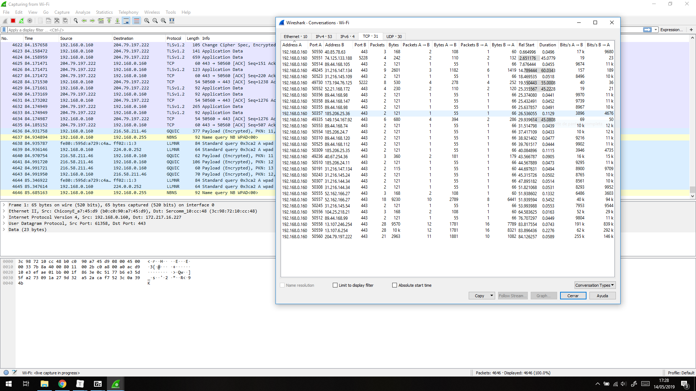

# Ejercicios Teoría SWAP

### Índice

##### - Tema 1

##### - Tema 2

##### - Tema 3

##### - Tema 4

##### - Tema 5

##### - Tema 6


 ## Tema1

#### Ejercicio 1: Buscar información sobre las tareas o servicios web para los que se usan más los programas que comentamos al principio de la sesión: 

+ **Apache**: Este servicio se utiliza como servidor web para creación de dominios y servicios. Es de los más utilizados hasta la fecha debido a la cantidad de opciones que ofrece y la participación de la comunidad. Y es gratis, que eso siempre suma.

+ **Nginx**: Al igual que el anterior, se utiliza como servidor web aunque es mucho más liviano.  También es gratuito y multiplataforma, lo que sumado a su rapidez lo hace el principal competidor de apache.

+ **Thttpd**: Otro servidor web un poco distinto a los anteriores. Es el más simple y ligero de todos (cuenta con las funcionalidades básicas), por ello es perfecto para alojar dominios web con información estçatica.

+ **Cherokee**: Este servidor se caracteriza por su optimización en cuanto a la gestión de concurrencia entre varios usuarios. Es más rápido que apache o nginx aunque no ofrece tanta funcionalidad.

+ **Node.js** Es un lenguaje de programación para el scripting en el lado del servidor. Surge a raíz del crecimiento de JavaScript y la necesidad de llevar un lenguaje de programación similar al lado del servidor. A pesar de esto el principal lenguaje en el lado del servidor sigue siendo PHP.

    

## Tema 2

#### Ejercicio 1: Calcular la disponibilidad del sistema si tenemos dos réplicas de cada elemento (en total 3 elementos en cada subsistema).

Componente | Inicial  | A<sub>1</sub> | A<sub>2</sub> | Resultado| 
:---------:|---------------|-----------------|----------|-----------|-----------
Web | 0.85 | 0.9775 | 0,996625 | 0.99662| 
Aplication | 0.90 | 0.99 | 0.999 | 0.999| 
DB | 0.999 | 0.999999 | 0.9999999 | 0.9999999 | 
DNS | 0.98 | 0.9996 | 0.999992 | 0.999992 | 
Firewall | 0.85 | 0.9775 | 0.996625 |0.996625| 
Switch | 0.99 | 0.9999 | 0.999999 | 0.999999 | 
Data center | 0.9999 | 0.9999 | 0.9999 | 0.9999| 
ISP | 0.95 | 0.9975 | 0.95 | 0.999875 | 
|||||
 | |  | **Total** | 0.99203087673 | 

No podemos replicar el centro de datos por motivos evidentes.

#### Ejercicio 2: Buscar frameworks y librerías para diferentes lenguajes que permitan hacer aplicaciones
altamente disponibles con relativa facilidad.

+ **PM2**: es un administrador de tareas que permite mantener, creado sobre un
    balanceador de carga que permite mantener activas las aplicaciones con una
    altísima disponibilidad y que facilita el trabajo de los administradores de
    sistemas.

+ **Hadoop**: es un framework que permite trabajar con diversas aplicaciones, está pensada para trabajar con muchas cantidades de datos, lo que lo hace ideal para tareas de *big data*.

    

## Tema 3

#### Ejercicio 1: Buscar con qué órdenes de terminal o herramientas podemos configurar bajo Windows y bajo Linux el enrutamiento del tráfico de un servidor para pasar el tráfico desde una subred a otra.
En Windows podemos usar el siguiente comando para añadir rutas a la tabla de enrutamiento y poder configurar el camino para permitir el tráfico de red a través del default gateway:

*route ADD [destino] MASK [mascara] [gateway] [metrica]*


Para Linux podemos usar el siguiente:

*route add -net [destino] netmask [mascara] gw [gateway]*

#### Ejercicio 2: Buscar con qué órdenes de terminal o herramientas gráficas podemos configurar bajo Windows
y bajo Linux el filtrado y bloqueo de paquetes.

La mayoría de usuarios de Windows no tiene mucho conocimiento sobre informática, por lo que existen multitud de herramientas gráficas que hacen que la experiencia no sea tan desagradable. Un ejemplo de esta herramienta sería el propio firewall de Windows, (Windows Defender), que permite configurar bastantes opciones de seguridad de una forma sencilla.

En Linux, por otro lado, el usuario es más avanzado por lo que mediante la terminal podemos usar comandos como *iptables* que permite crear reglas que analizarán los paquetes de datos que entran, salen o pasan por nuestro sistema, y en función de las condiciones que establezcamos, tomaremos una decisión que normalmente será permitir o denegar que dicho paquete siga su curso.


## Tema 4

#### Ejercicio 2: Buscar información sobre precio y características de balanceadores comerciales (hardware) específicos. Compara las prestaciones que ofrecen unos y otros.


#### Ejercicio 6: Buscar información sobre los bloques de IP para los distintos países o continentes. Implementar
en JavaScript o PHP la detección de la zona desde donde se conecta un usuario.

Hay varias formas de detectar la zona de conexión del usuario, desde usar la información que proporciona el navegador hasta APIs que reconoce HTML5. 

```
function ipLookUp () {
  $.ajax('http://ip-api.com/json')
  .then(
      function success(response) {
          console.log('User\'s Location Data is ', response);
          console.log('User\'s Country', response.country);
      },

      function fail(data, status) {
          console.log('Request failed.  Returned status of',
                      status);
      }
  );
}
ipLookUp()
```

En el siguiente link podemos ver cómo funciona este ejemplo y otros tantos usando distintos métodos.

<https://medium.com/@adeyinkaadegbenro/how-to-detect-the-location-of-your-websites-visitor-using-javascript-92f9e91c095f>


## Tema 5

#### Ejercicio 1: Buscar información sobre cómo calcular el número de conexiones por segundo.

En Linux encontramos  varios comandos que nos  permiten calcular dicho dato. Por ejemplo:

*netstat | grep http | wc -l*


#### Ejercicio 2: Instalar Wireshark y observar cómo fluye el tráfico de red en uno de los servidores web
mientras se le hacen peticiones HTTP... o en la red de casa.




#### Ejercicio 3: Buscar información sobre características, funcionalidad, disponibilidad para diversos SO, etc de herramientas para monitorización
Para Linux podemos usar distintos comandos que nos proporcionan información sobre el sistema:

- ***top:*** Sirve para supervisar el rendimiento, muestra todo el funcionamiento y los procesos en tiempo real, el uso de CPU, de memoria, la memoria de intercambio, la caché, tamaño de búfer, PID de proceso, usuario, carga de memoria...
- ***vmstat:*** Proporciona datos sobre la memoria virtual, discos, procesos del sistema, memoria, bloques de E/S, interrupciones y actividad de la **CPU.**
- ***netstat:*** Es una herramienta de línea de comandos que muestra un listado de las conexiones activas, tanto entrantes como salientes y las estadísticas de la interfaz.
- ***lsof:*** Se utiliza para hacer reportes de archivos y los procesos que están utilizando a éstos. Se puede utilizar para revisar que procesos están haciendo uso de  directorios, archivos ordinarios, tuberías (pipes), sockets y dispositivos.

En Windows Server podemos encontrar los siguientes:

- **Cacti:** Es una interfaz completa para RRDTool, almacena toda la información necesaria para crear gráficos y rellenarlos con datos en una base de datos MySQL.
- **Zabbix:**  Es una herramienta a gran escala para la supervisión de redes y sistemas que combina varias funciones en una consola web. Puede configurarse para monitorear y recopilar datos de una amplia variedad de servidores y dispositivos de red, y proporciona un servicio y monitoreo de rendimiento de cada objeto. Zabbix permite monitorear servidores y redes con una amplia gama de herramientas, incluido el monitoreo de hipervisores de virtualización y pilas de aplicaciones web.


## Tema 7

#### Ejercicio 1: Buscar información sobre los sistemas de ficheros en red más utilizados en la actualidad y comparar sus características. Hacer una lista de ventajas e inconvenientes de todos ellos, así como grandes sistemas en los que se utilicen.

El Network File System (Sistema de archivos de red), o NFS, es un protocolo de nivel de aplicación, 
según el Modelo OSI. Es utilizado para sistemas de archivos distribuido en un entorno de red de 
computadoras de área local. Posibilita que distintos sistemas conectados a una misma red accedan 
a ficheros remotos como si se tratara de locales. Originalmente fue desarrollado con el objetivo de 
que sea independiente de la máquina, el sistema operativo y el protocolo de transporte, esto fue 
posible gracias a que está implementado sobre los protocolos XDR (presentación) y ONC RPC.


Los sistemas de ficheros en red o NFS (Network File System) es un mecanismo que encontramos en la capa de aplicación del modelo OSI y que nos permite almacenar los archivos en una red permitiendo que los usuarios puedan acceder a ellos como si trabajaran con archivos y directorios locales.

Para ello se hace uso de un servidor que será el que almacene los datos, y serán los clientes los que operen con ellos.

Las versiones de NFS más importantes son NFSv2 (RFC 1094), NFSv3 (RFC 1813) y NFSv4 (RFC 3530).

- **Ventajas NFS** 
  - Reducen el riesgo de que el fallo de un solo equipo impida acceder a los datos.
    Proporcionan ubicaciones centralizadas para los datos que deben o deberían estar compartidas entre todos los usuarios.
  - Simplifican el acceso a los datos existentes en sistemas más veloces.
  - Proporcionan la oportunidad de centralizar operaciones administrativas, tales como la copia de seguridad de los datos (back-ups).
  - Proporcionan interoperabilidad y flexibilidad. Normalmente se puede acceder a sistemas de ficheros en red desde ordenadores que ejecuten Linux, Windows, Mac OS X, BeOS, BSD, y muchos otros. De esta forma es fácil utilizar el hardware y software más adecuado a los requerimientos de escritorio, y aun así acceder a los mismos datos del entorno de sistema de ficheros en red.
- **Desventajas NFS**
  - NFSv2 y NFSv3 pueden utilizar UDP como protocolo de transporte que al ser una conexión desatendida, minimiza el tráfico de red, pero si el servidor NFS cayera por cualquier circunstancia, los clientes NFS seguirían enviando peticiones al servidor produciendo el efecto contrario, que es la saturación de la red.
  - Las versiones 2 y 3 de NFS permiten controlar la exportación y montaje de sistemas de archivos en función del equipo que hace la solicitud, pero no del usuario. Es decir no se contempla un control de acceso al sistema de archivos por usuario. Solo para los equipos. Esto implica que si un sistema de archivos es exportado desde el servidor NFS, cualquier usuario de un equipo remoto cliente NFS podría acceder a él.
  - NFS sufre algunos problemas de rendimiento debido a su diseño “sin estado” (parte de estos problemas son mitigados en las últimas versiones de NFS). En particular, como el cliente asume que una operación de escritura se completa una vez que recibe el acuse de recibo del servidor, el servidor debe asegurarse de escribir cada bloque a disco antes de responder, para evitar discrepancias en el caso de una caída. Esto introduce un retardo significativo en el caso de escrituras NFS.

Por ejemplo en la red de la universidad, los datos se mantienen en varios servidores y el personal de administración y servicios opera con esa información remotamente, sin mantener una copia física en local.