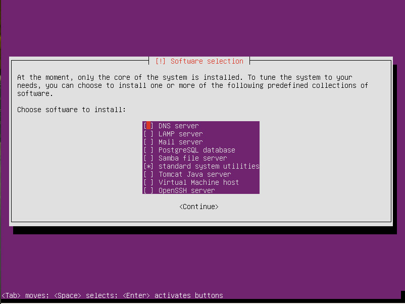

# Práctica 1

## Creación de Servidores

### Índice

1. #### Instalación de Ubuntu Server

2. #### Configuración de Red en VirtualBox

3. #### Configuración de Red en Servidor

4. #### CURL

5. #### SSH

#### Instalación de Ubuntu Server

Para la instalación del servidor he optado por usar Ubuntu Server en su versión 16.04. Seguimos los pasos por defecto indicando la opción de instalar LAMP para tener que evitar que instalar después todos los recursos necesarios para poner en marcha el servidor, PostgreSQL como gestor de base de datos y OpenSSH para poder conectarnos remotamente a la máquina.

Una vez hemos instalado la máquina podemos conectarnos a internet usando la conexión del host, pero debemos establecer la propia del servidor para poder conectarnos a él y que sea visible para las otras máquinas.

#### Configuración de Red en VirtualBox

#### 