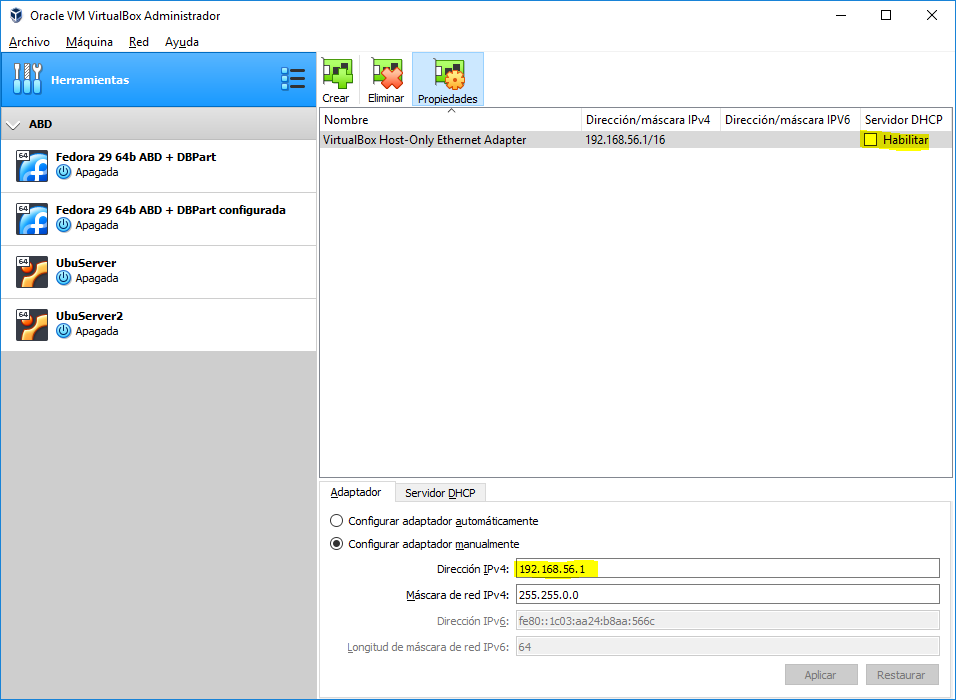
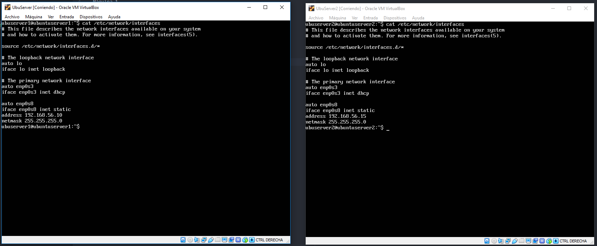
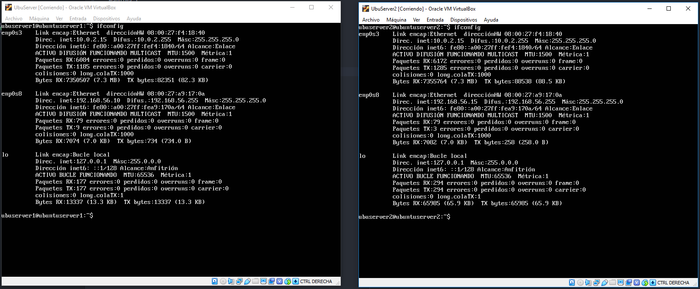
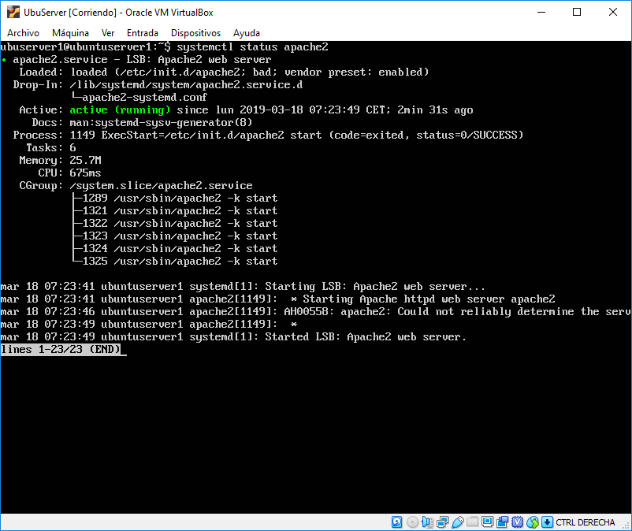
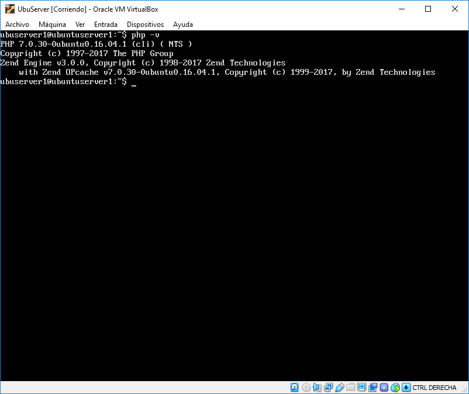
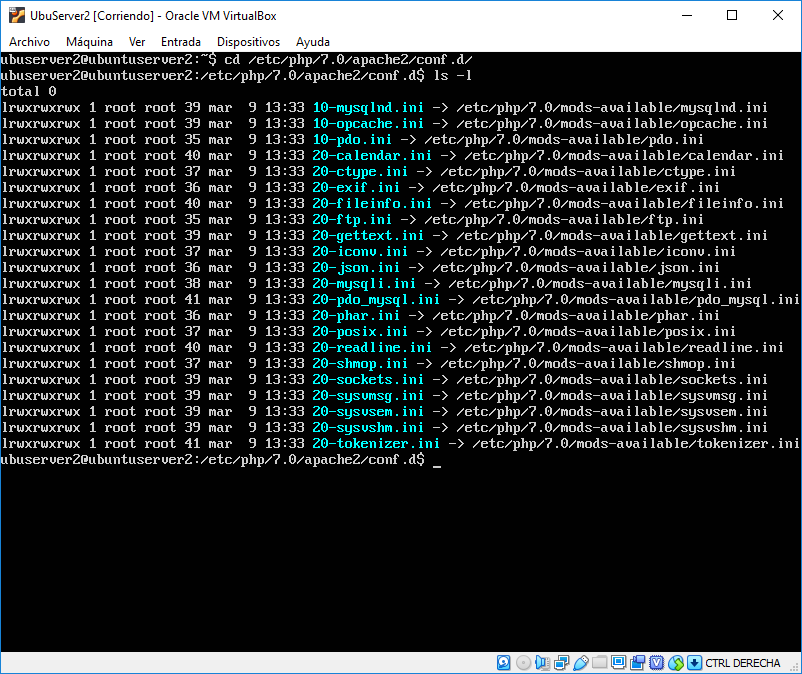
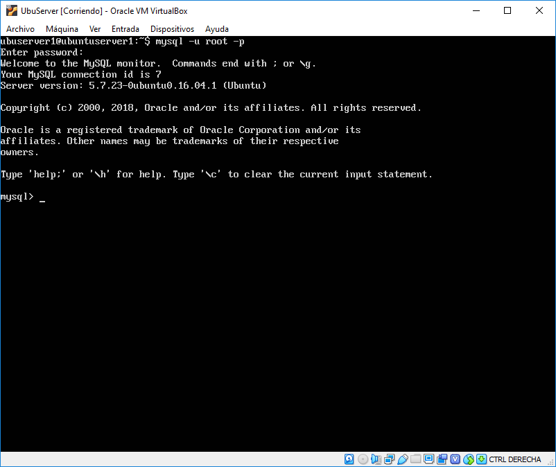
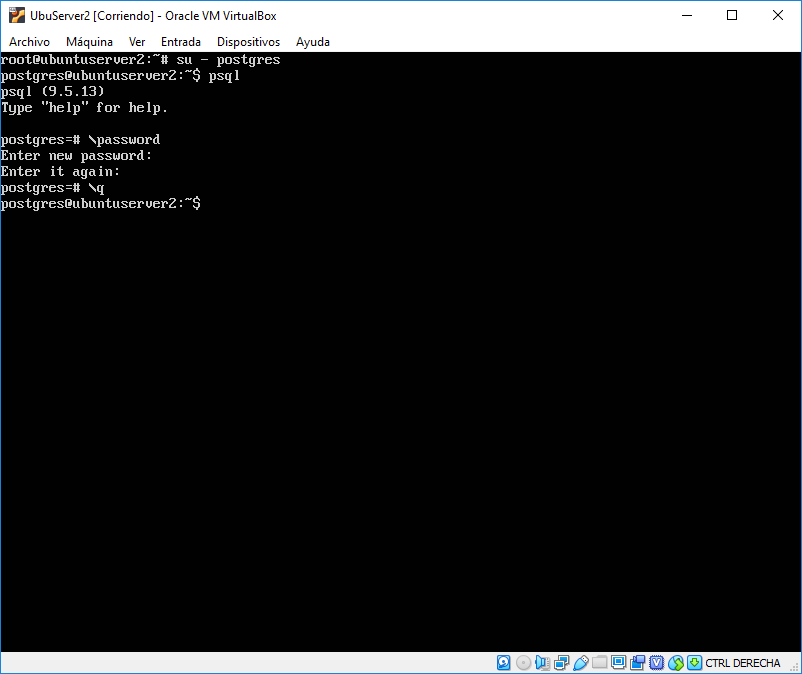
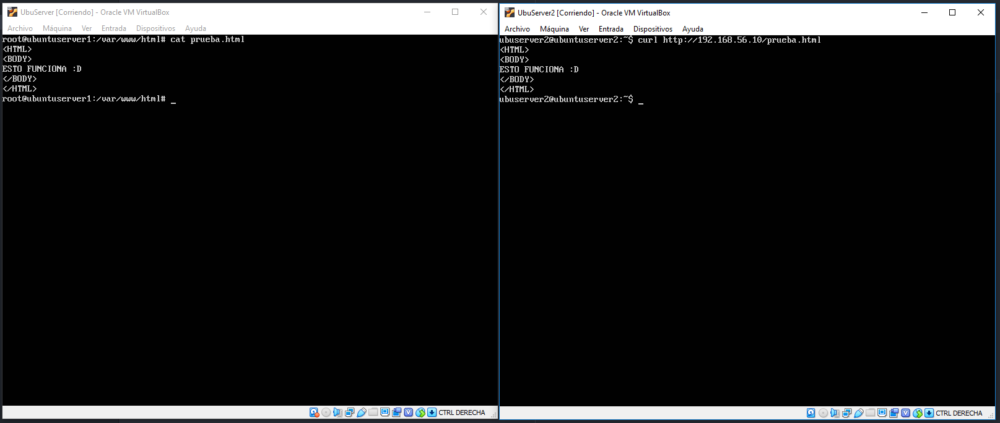
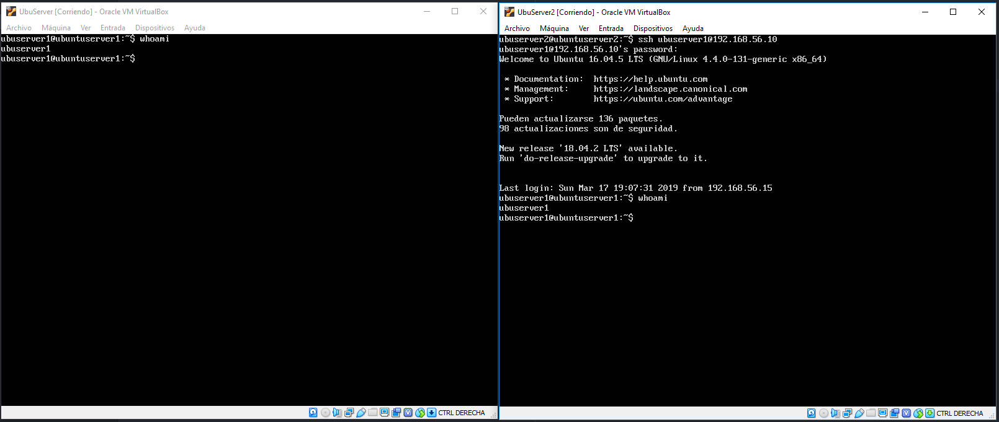

# Práctica 1: Creación de Servidores

## Índice

1. ### [Instalación de Ubuntu Server](#id1)

2. ### [Configuración de Red en VirtualBox](#id2)

3. ### [Configuración de Red en Servidor](#id3)

4. ### [Estado servidor](#id4)

5. ### [CURL](#id5)

6. ### [SSH](#id6)

## Instalación de Ubuntu Server

Para la instalación del servidor he optado por usar Ubuntu Server en su versión 16.04. Seguimos los pasos por defecto indicando la opción de instalar LAMP para tener que evitar que instalar después todos los recursos necesarios para poner en marcha el servidor, PostgreSQL como gestor de base de datos y OpenSSH para poder conectarnos remotamente a la máquina.

Una vez hemos instalado la máquina podemos conectarnos a internet usando la conexión del host, pero debemos establecer la propia del servidor para poder conectarnos a él y que sea visible para las otras máquinas.

## Configuración de Red en VirtualBox

Para poder hacer visible la máquina debemos añadir una tarjeta de red en modo solo anfitrión y establecer en la configuración de VirtualBox la ip del host y desmarcar la opción DHCP para evitar que la IP cambie dinámicamente.

## Configuración de Red en Servidor

Una vez conocemos la IP de nuestro host debemos crear una red en nuestra máquina con una IP estática para facilitar la conexión a ella. Para ello creamos una nueva interfaz en la que establecemos una IP estática dentro de la subred de nuestro host, es decir, si nuestro host tiene la dirección 192.168.56.1 debemos encontrar una dirección libre dentro de 192.168.56.X. En mi caso creo las siguientes interfaces.

Una vez creadas podemos reinicar todo para comprobar que son válidas.

## Estado servidor

Durante la instalación de Ubuntu Server hemos instalado LAMP y PostgreSQL como gestor de base de datos. Vamos a comprobar que están en funcionamiento.

Comprobamos el estado de apache haciendo *systemctl status apache2* y vemos que el proceso está activo.

Para probar que PHP está instalado podemos usar *php -v* o comprobar que existe el siguiente directorio.

Y por último vamos a acceder al gestor de base de datos por defecto desde el modo root y al gestor que seleccionamos al instalar el sistema, PostgreSQL. Para entrar a mysql pasaremos a la cuenta root y entraremos usando su contraseña.

En caso de entrar a PostgreSQL cambiaremos el usuario a  '*postgres*' y nos conectaremos con el gestor haciendo uso del comando *psql* y una vez dentro cambiaremos la contraseña para que el acceso sea más sencillo y no tener que recordar demasiadas contraseñas, aunque obviamente esto no es una buena práctica.

## CURL

Una vez hemos creado y configurado las interfaces de las dos máquinas podemos crear un fichero de prueba HTML para probar si podemos establecer conexión de una máquina a la otra.

En la primera máquina creamos un fichero de prueba en el directorio */var/www/html* y en la segunda máquina hacemos una petición de ese archivo poniendo la dirección de la primera máquina. Como podemos comprobar la segunda máquina realiza la petición y recibe el archivo.

## SSH

Sabiendo ya que las máquinas se ven podemos usar SSH para probar la conexión remota.

Al hacer SSH en la segunda máquina especificamos el usuario al que nos queremos conectar en la primera máquina y la dirección del host al que establecemos la conexión, ponemos la contraseña de ese usuario y al hacer *whoami* se ve claramente que estamos trabajando remotamente en la primera máquina como el usuario *ubuserver1*.

