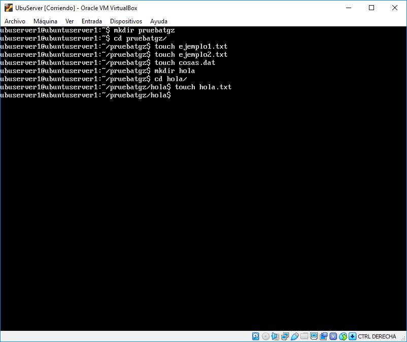
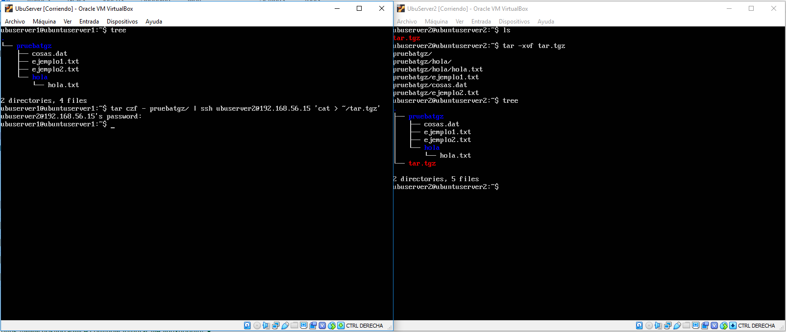
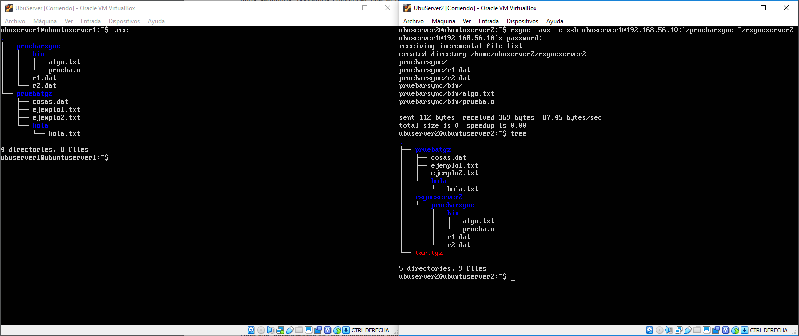
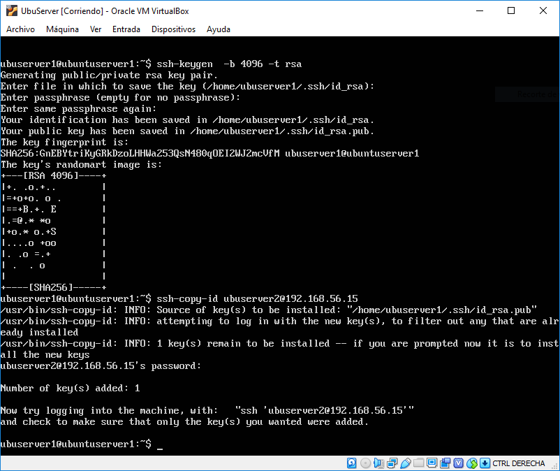
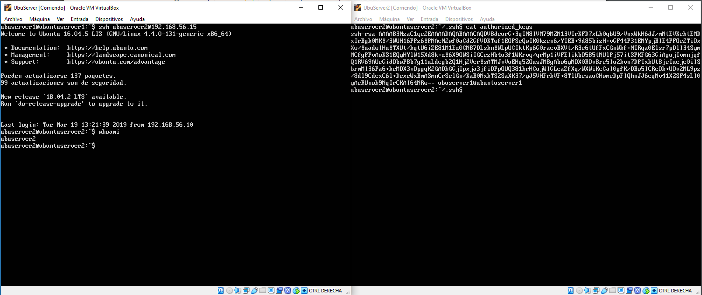
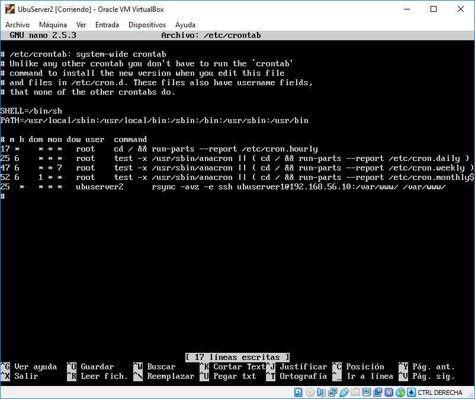
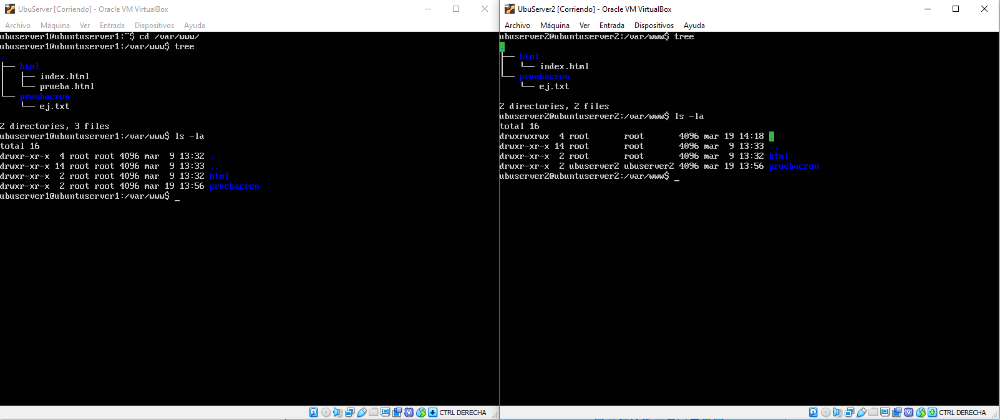

# Práctica 2: Sincronización entre servidores

## Índice

1. #### [Ejecutar comandos remotamente](#id1)

2. #### [Sincronización de archivos con rsync](#id2)

3. #### [Gestión de claves para conexión ssh](#id3)

4. #### [Sincronización automática usando cron](#id4)

### Ejecutar comandos remotamente

En este primer apartado suponemos el caso de que un servidor no disponga de espacio en el disco local para crear un fichero *tar.gz*, para solucionar esto usaremos *ssh* para crear el fichero en el equipo destino.

Crearemos un directorio con varios archivos de prueba dentro para comprobar que funciona.

Como podemos comprobar, al realizar la compresión y conectarnos a la segunda máquina mediante *ssh* especificamos la ruta y el nombre. Al irnos a la segunda máquina podemos ver que se ha creado en la ruta especificada el fichero con la compresión. Si descomprimimos y ejecutamos *tree* se aprecia que contamos con la misma estructura en ambas máquinas. 

### Sincronización de archivos con rsync

En el caso anterior hemos compartido un directorio que comprimimos, pero también podemos compartir directorios y mantener una sincronización, tal como hace Google Drive, Dropbox, Mega... etc. Para ello descargamos rsync y ejecutamos el siguiente comando. En él, especificamos la máquina y el usuario al que nos conectamos, la ruta del fichero o directorio que queremos sincronizar y el nombre que tendrá en nuestra máquina.

Para este caso creo otro directorio en la máquina 1 y ejecuto *rsync* desde la máquina 2 y se puede comprobar que se crea el nuevo directorio y se copian todos los archivos del directorio especificado.

 

### Gestión de claves para conexión ssh

Para agilizar la conexión entre máquinas podemos compartir las claves públicas para que así las máquinas se conozcan y puedan descifrar las peticiones automáticamente sin necesidad de introducir una contraseña. Para ello lo primero que hacemos es generar las claves pública y privada para cada máquina y copiarla a la máquina destino haciendo uso de *ssh-copy-id*. 

Una vez hemos copiado la clave si nos vamos a la máquina destino y comprobamos el fichero *authorized_keys* del directorio ssh,  podemos verificar que aparece la clave publica de la primera máquina. Y efectivamente al hacer ssh desde la primera máquina a la segunda podemos conectarnos sin necesidad de introducir la contraseña.

### Sincronización automática usando cron

Lo primero que debemos hacer es modificar nuestro archivo */etc/crontab* en la máquina 2 e indicaremos que queremos sincronizar el directorio */var/www/* de la máquina 1.

Una vez hecho esto debemos reiniciar el servicio de cron mediante *sudo service cron restart* y debemos asegurarnos de que el usuario ubuserver2 tenga permisos de escritura en el directorio */var/www*. En caso de no tener debemos dárselos de la siguiente forma *sudo chmod oug+rw /var/www/*. Una vez hecho esto ya debería empezar a sincronizarse el directorio.

En mi caso he creado un directorio de prueba para comprobar que la sincronización y tras reiniciar cron he obtenido en la máquina 2 el contenido de la 1 de forma automática. Ahora este proceso se realizará automáticamente cada hora a los 25 minutos.