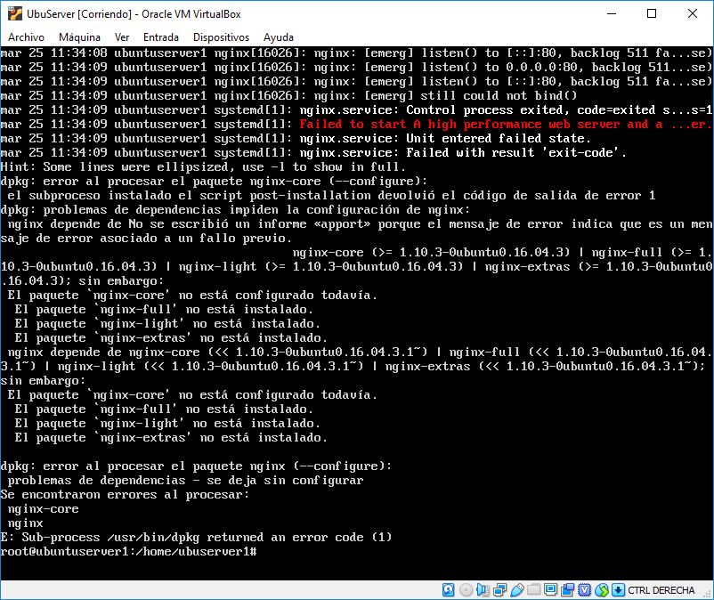
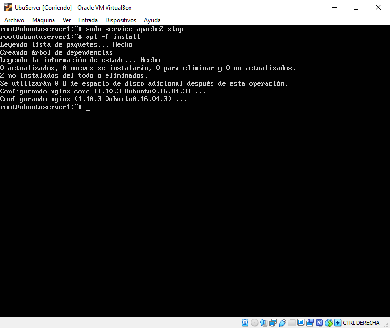
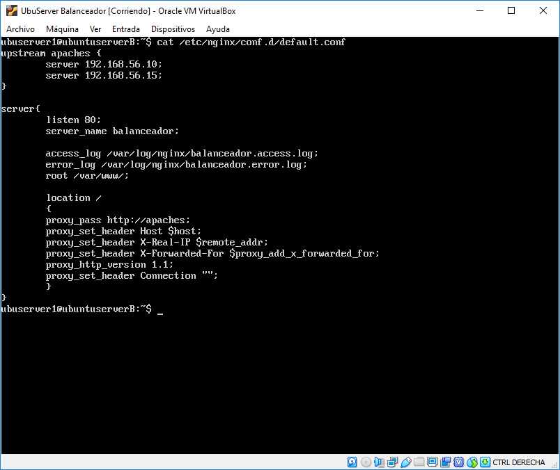
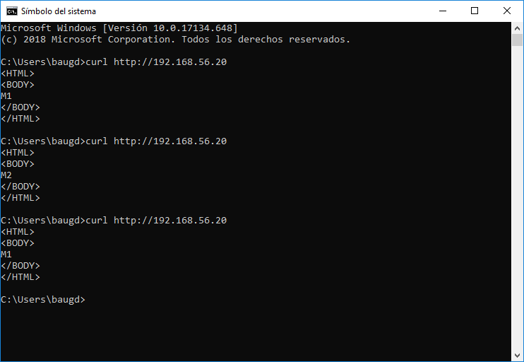
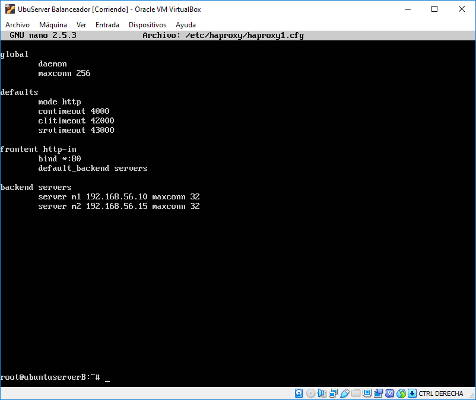
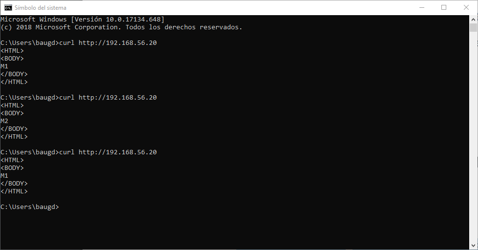
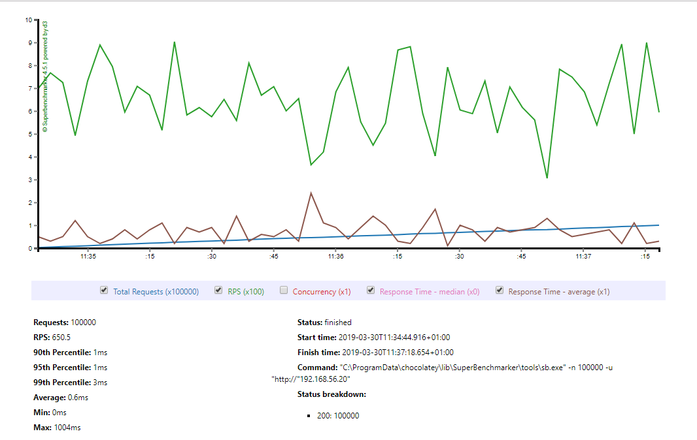
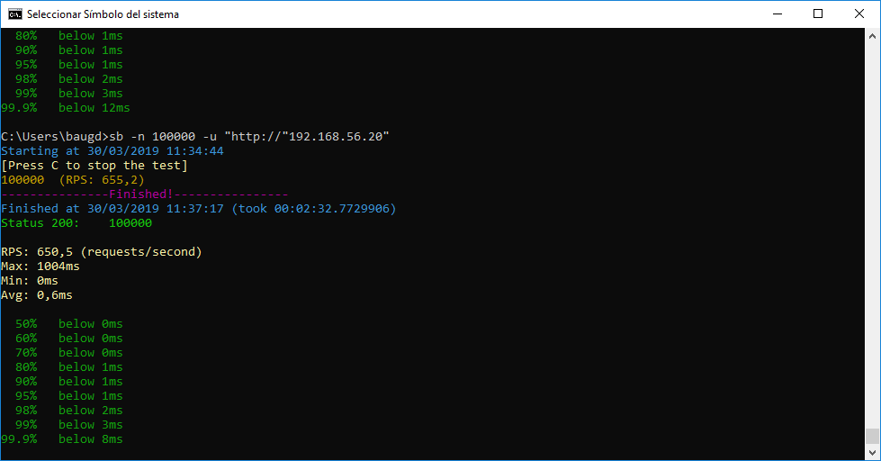
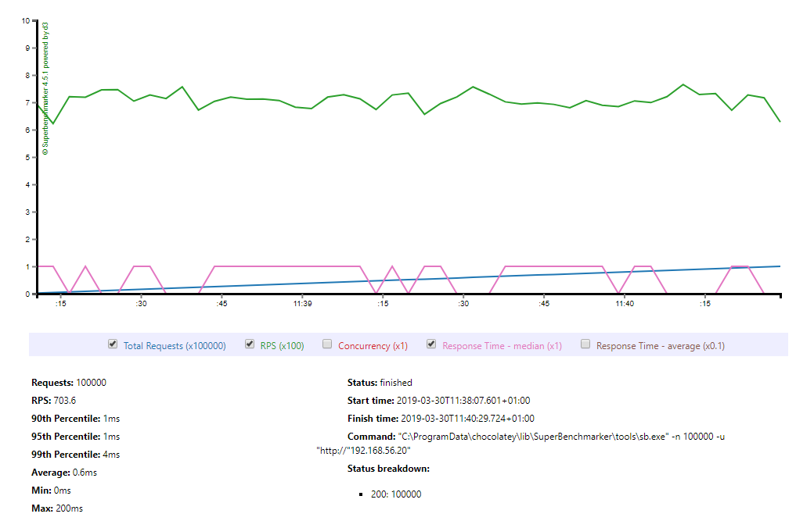
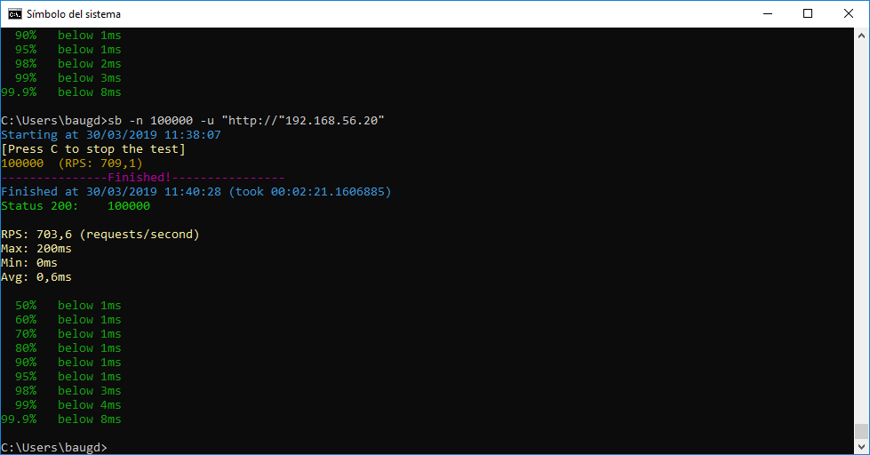

# Práctica 3: Balanceo de carga

## Índice

1. ### [Instalación nginx](#id1)
2. ### [Configuración](#id2)
3. ### [Balanceo de carga nginx](#id3)
4. ### [Instalación haproxy](#id4)
5. ### [Configuración haproxy como balanceador](#id5)
6. ### [Comprobación funcionamiento](#id6)
7. ### [Ejemplo de balanceo con alta carga](#id7)

## Instalación nginx

Para esta práctica habremos creado un balanceador de carga que nos permitirá distribuir la carga de trabajo entre los servidores de la granja. Para ello crearemos una máquina virtual en la que instalaremos el software para balancear. Las imágenes que aparecen a continuación son de una máquina clonada, pero al realizar el mismo proceso desde una máquina virtual nueva no he obtenido ningún error. Al crear una máquina nueva debemos realizar el mismo proceso que con las máquinas anteriores y configurar la red y las *keys* para el acceso remoto. En mi caso para el balanceador he usado la dirección **192.168.56.20**.

Lo primero que debemos hacer es actualizar el sistema para asegurar un mejor funcionamiento de la herramienta. Al intentar instalarlo puede que obtengamos este error.

Esto se debe a que estamos intentando instalar nginx mientras apache está activo, por lo que pararemos apache mediante *sudo service apache2 stop* y resolveremos el problema de instalación de nginx ejecutando lo siguiente *apt -f install*.

## Configuración

Una vez instalado deberemos configurar el balanceador para hacer que la carga se reparta entre los servidores que tenemos activos. Para ello haremos uso de la directiva *upstream* para especifar la dirección de ambos servidores y crear un grupo sobre el que se repartirá la carga. Y después especificaremos las características del servidor.

Para modificar la configuración de nginx accederemos al fichero */et/nginx/conf.d/default.conf* y lo modificaremos de la siguiente forma.

Tras crear la configuración hacemos sudo *service nginx restart* para que se vuelva a iniciar con la configuración que acabamos de crear y al hacer *curl* a la dirección del balanceador deberíamos obtener lo siguie3te.

## Balanceo de carga nginx

Como se puede ver, al realizar una petición al balanceador este va distribuyendo el trabajo a los distintos nodos.

## Instalación de haproxy

Lo primero que haremos será parar los servicios de nginx para evitar errores con la instalación y configuración de haproxy. Ejecutamos *sudo service nginx stop* para detenerlos y a continuación procedemos a instalar haproyx.

## Configuración de haproxy

Una vez instalado deberemos modificar los archivos de configuración para que funcione con nuestras máquinas. Accederemos a */etc/haproxy/haproxy.cfg* para modificar la configuración por defecto.

## Comprobación funcionamiento

Estando ya configurado el balanceador reiniciaremos el proceso y lo cargaremos con la configuración que hemos creado mediante el uso del siguiente comando *sudo /usr/sbin/haproxy -f /etc/haproxy/haproxy.cfg* y obtenemos lo siguiente.

Podemos ver que aparecen unos warnings que nos indican que algunas directivas que hemos usado en la configuración están obsoletas y no será compatible en futuras versiones. Como tan sólo queremos comprobar el funcionamiento del balanceador ignoraremos estas advertencias, aunque un buen administrador debería actualizar la configuración para evitar que el sistema fallara en un futuro.

Al acceder al servidor desde el host podemos comprobar que la configuración de haproxy ha sido un éxito y balancea la carga perfectamente.

## Ejemplo de balanceo con alta carga

Para comprobar como reaccionará nuestra granja ante una gran carga de trabajo usaré el siguiente benchmark en mi host: [SuperBenchmarker](https://github.com/aliostad/SuperBenchmarker)

Una vez instalado podemos hacer peticiones mediante el comando *sb -u "http://ejemplo.com"*

Para testear el funcionamiento he modificado el *index.html* de ambos servidores y he introducido unas pocas imágenes para que la web sea un poco más grande. Antes de mostrar los resultados del test he de decir que al realizarlos desde el host y tener corriendo 3 máquinas virtuales los resultados que obtenemos no son fiables, ya que se están compartiendo recursos, pero como tan sólo es una prueba para clase podremos analizar los resultados y ver cómo afecta el uso de distintos servidores.

##### Haproxy

En la ejecución del *benchmark* usando como balanceador *Haproxy* y lanzando **100.000 peticiones**, se ha resuelto en **2 minutos y 32 segundos**, y como podemos ver en la gráfica tenemos varios picos en el número de peticiones por segundo (**RPS**, *Requests per Second*). Esto también implica que el tiempo de respuesta medio por petición también será un poco más inestable.

##### Nginx

Ejecutando el mismo *benchmark* y usando como balanceador *Nginx* , se ha resuelto en **2 minutos y 21 segundos**. En este caso vemos que el número de peticiones por segundo no presenta tantos dientes de sierra, y respecto al tiempo de respuesta medio se puede apreciar que alcanza un máximo, lo cual en conjunto, hace que *Nginx* sea más apropiado para nuestro sistema como balanceador de carga, pero esto no quiere decir que *Nginx* siempre sea mejor.

En conclusión, al establecer una granja web se debe testear con distintos balanceadores y configuraciones para intentar optimizar el funcionamiento de la misma. En nuestro caso, usando *Nginx* y *Round Robin* con un peso equivalente entre nuestras dos máquinas finales obtenemos un buen resultado.