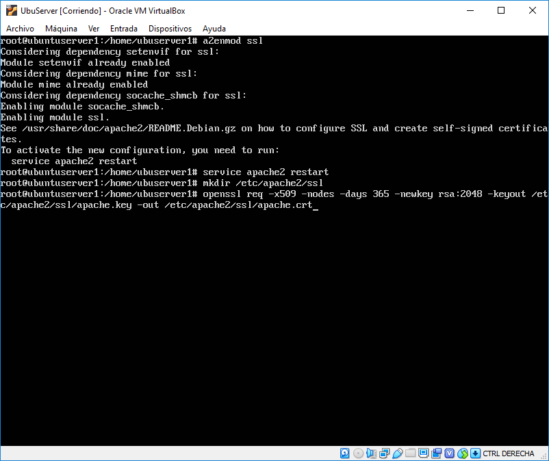
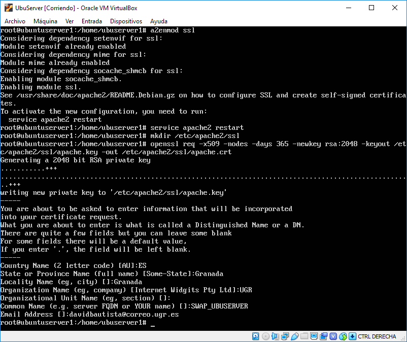
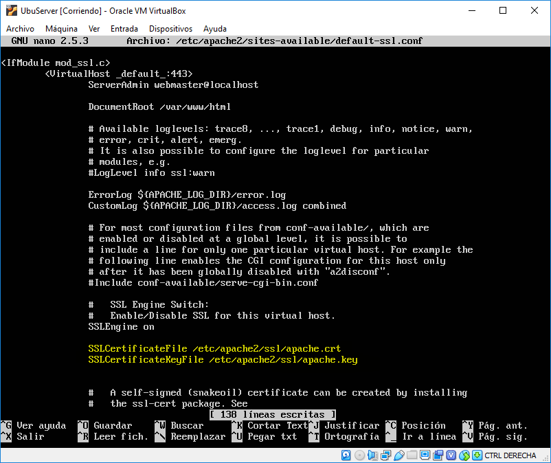
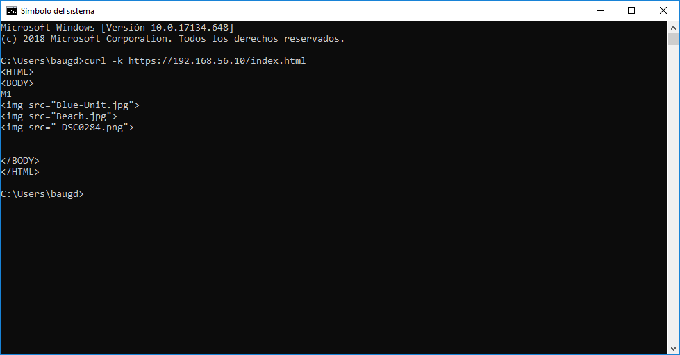
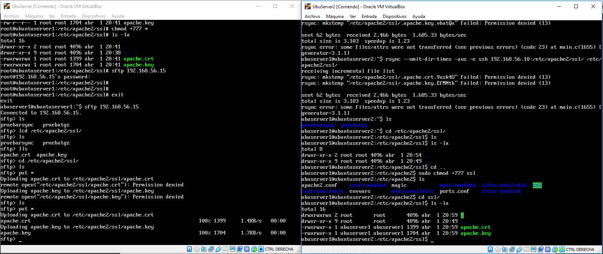
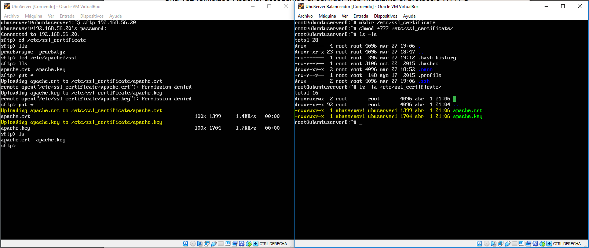
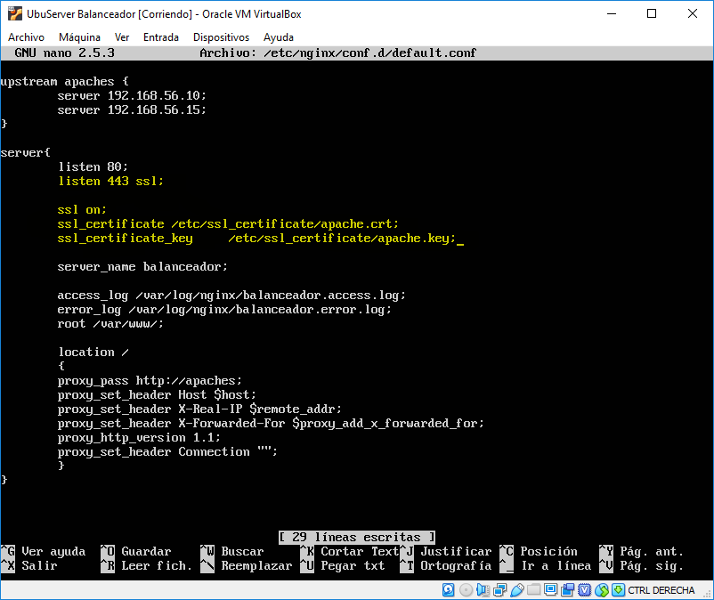
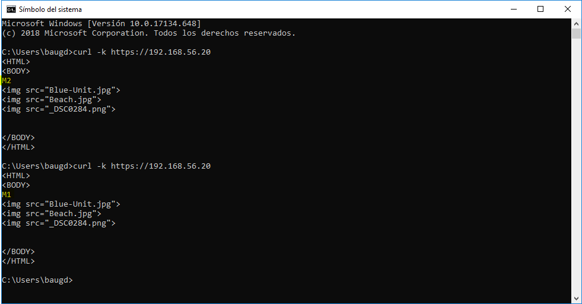

# Práctica 4: Asegurar la granja web

## Índice

1. ### [Instalación certificado SSL](#id1)

2. ### [Configuración del cortafuegos](#id2)

## Instalación certificado SSL

Los certificados nos permiten asegurar que la conexión que mantienen los clientes con el servidores es segura, de esta forma hacemos saber a los usuarios que pueden registrar sus datos personales con certeza de que no va a ocurrir nada malo.

En esta práctica veremos como instalar un certificado **SSL** (*Secure Sockets Layer*), aunque la versión actual no cumple con los estándares y se considera insegura. Al ser una práctica de clase instalaremos un certificado auto-firmado usando la herramienta *openssl*.

Lo primero que haremos será activar el módulo para apache y crear un directorio en el que almacenaremos el certificado.

Al crear el certificado se nos pide una serie de datos:

Habiendo ya creado el certificado procedemos a integrarlo dentro de apache indicando el certificado y su key. Para que la granja web sea lo más homogénea posible todos los servidores deben tener el mismo certificado y clave.

Tras restablecer Apache y haber cargado el certificado podemos usar el host para hacer *curl* y comprobar que efectivamente ahora podemos establecer una conexión segura. Una vez hemos comprobado que el certificado **SSL** nos permite la conexión segura deberemos copiarlo a las otras máquinas. Para esto he usado **SFTP** para conectarme remotamente desde la máquina en la que hemos creado el certificado a las otras máquinas en las que copiaremos los archivos. Debemos tener en cuenta que debemos darle permisos al usuario para que pueda modificar el directorio */etc/apache2/ssl/* para que podamos transferir los archivos sin ningún error.

Al copiarla en nuestro segundo servidor, debemos realizar el mismo proceso que con el primero, debemos modificar la configuración de apache y establecer los certificados que acabamos de copiar. Una vez hecho esto al reiniciar apache deberíamos ser capaces de establecer una conexión segura con esta máquina.

Respecto al balanceador, no usamos apache, por lo que al copiar el certificado modificaremos la configuración del balanceador para que sea este el que reconoce la conexión.

En nuestro caso, podemos modificar el archivo de configuración de *nginx* para añadir el **puerto 443** que es el encargado de atender las peticiones de *HTTPS* y añadir los certificados que hemos copiado desde la primera máquina.

Al guardar la configuración y reiniciar *nginx* deberíamos ser capaces de ver lo siguiente.

Ahora podemos establecer una conexión segura con cualquier máquina, incluso el balanceador, y este sigue teniendo su comportamiento habitual, nos permite distribuir la carga de trabajo entre las máquinas finales.

