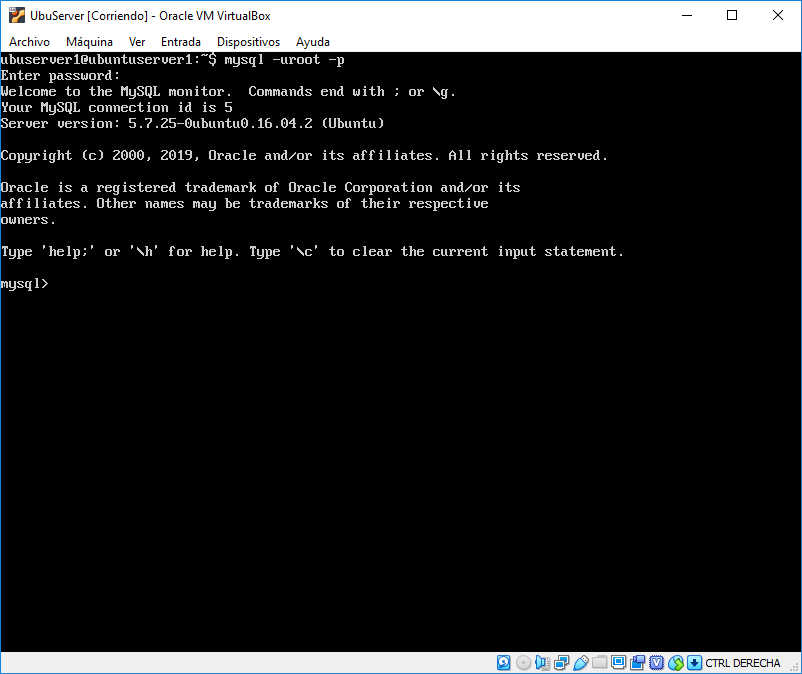
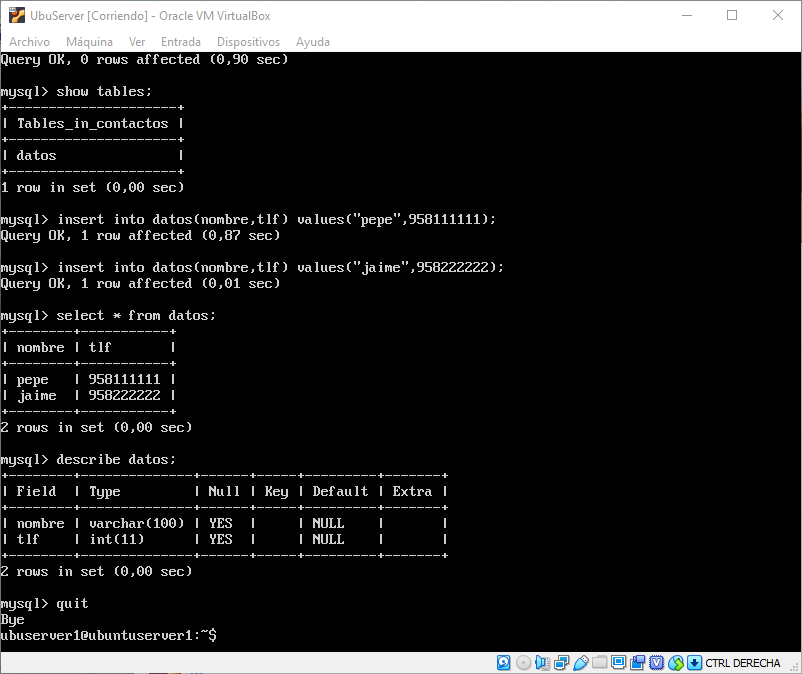
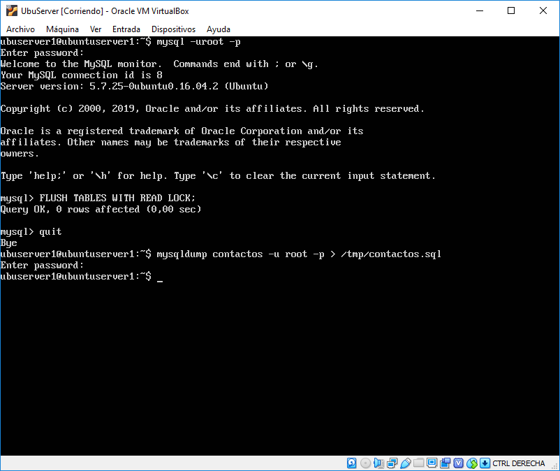
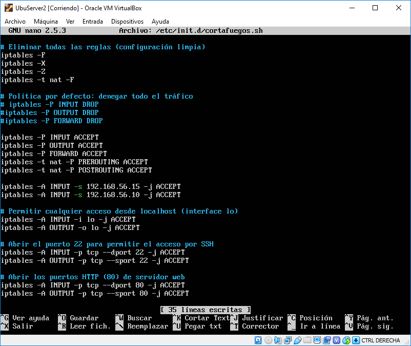
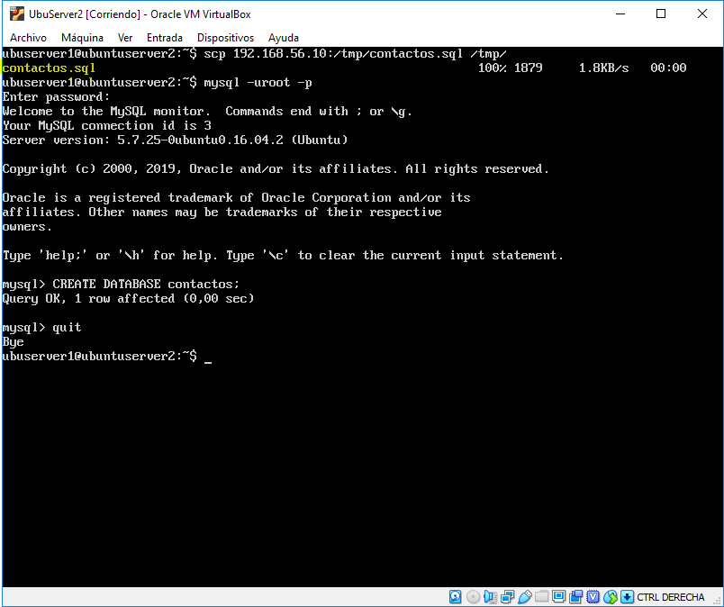
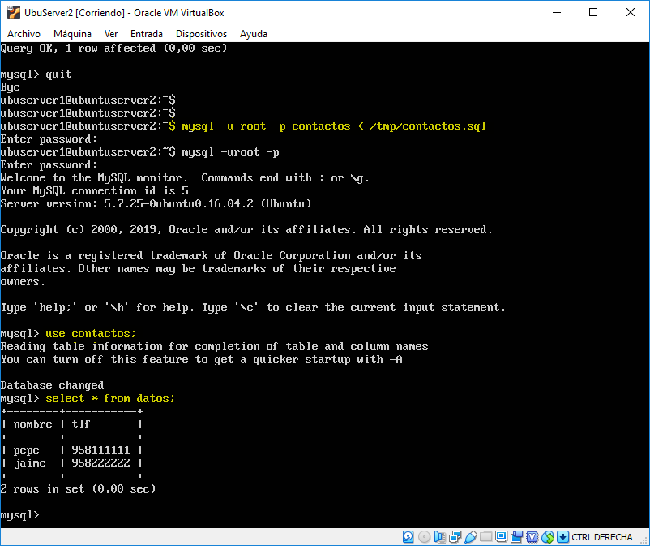
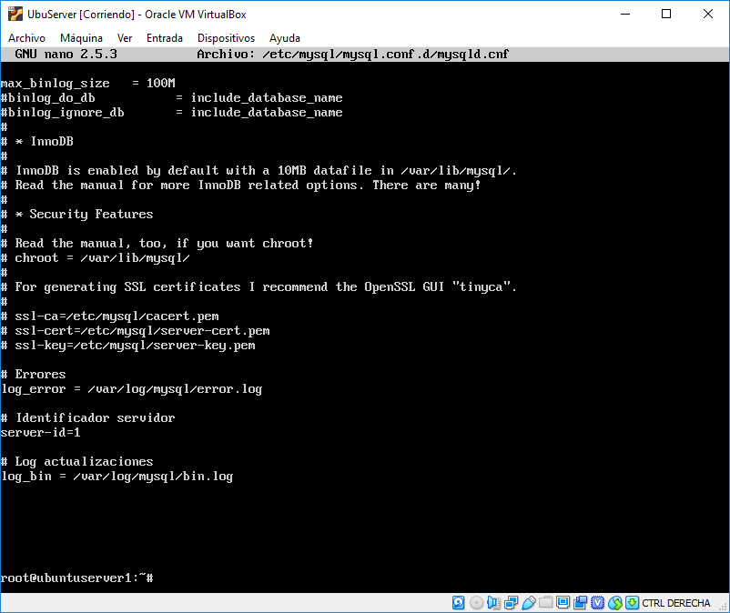
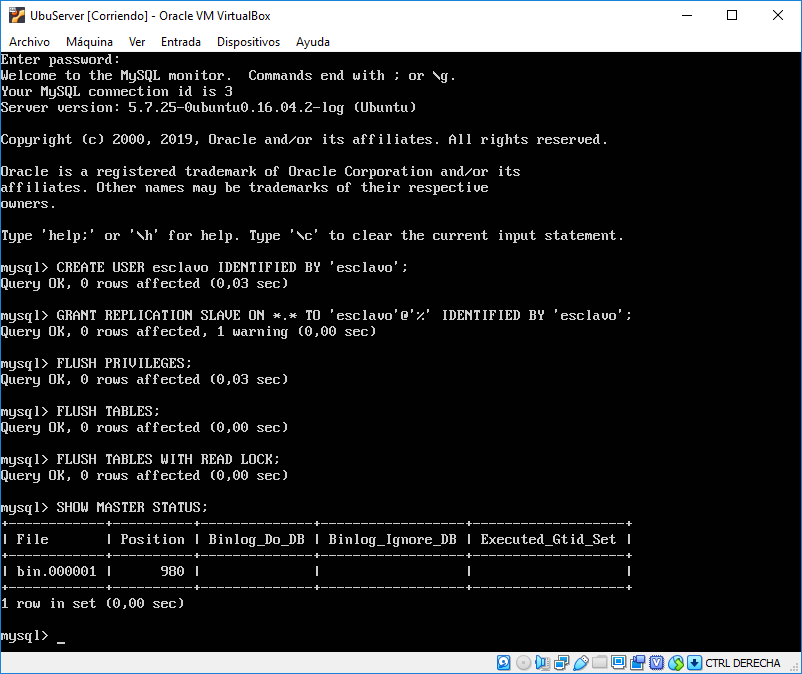
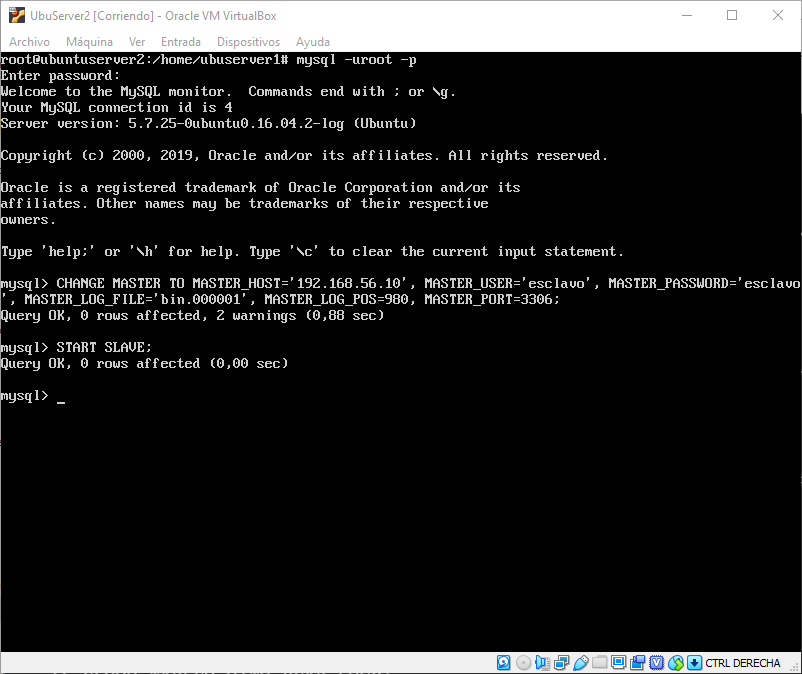
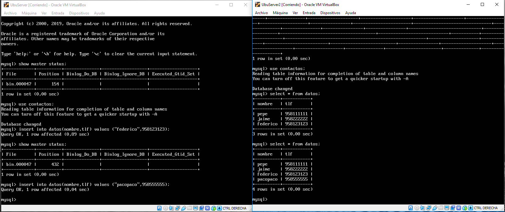

# Práctica 5:  Replicación de bases de datos MySQL

## Índice

### 1.  [Crear una base de datos e insertar datos](#id1)

### 2.  [Replicar una BD MySQL con mysqldump](#id2)

### 3.  [Replicación de BD mediante una configuración maestro-esclavo](#id3)

## Crear una base de datos e insertar datos

Para el desarrollo de esta práctica lo primero que deberemos realizar es crear una nueva base de datos y unas pocas tablas y registros para comprobar que somos capaces de establecer una estructura maestro-esclavo en la que una máquina principal funcione y la otra actúe como copia de seguridad.

Para acceder a la base de datos usaremos la contraseña que utilizamos al instalar mysql usando lamp.

Crearemos una nueva base de datos y una tabla llamada *datos* en la que guardaremos dos columnas, un nombre y un teléfono. Y también rellenaremos unas filas para probar que podemos copiar los datos.

## Replicar una BD MySQL con mysqldump

Hay varias formas de replicar una base de datos, para comenzar deberíamos comentar las dos principales copias de seguridad que tenemos:

- Copias de seguridad en frio: Para este tipo de copias de seguridad deberemos volcar todos los registros al disco y una vez hecho esto podremos apagar la base de datos para copiarla y así evitar perder la información de las transacciones en curso. Este tipo de copias de seguridad son las más sencillas y las más seguras, aunque es necesario apagar la base de datos, cosa que no siempre es posible.
- Copias de seguridad en caliente: En esta variante copiaremos la base de datos mientras aún funciona, por lo que necesitaremos de unos ficheros auxiliares que nos permitan seguir permitiendo transacciones mientras copiamos los datos, y una vez se han copiado los datos volcaremos estas transacciones en disco.

Para esta práctica replicaremos una copia en frío de la primera máquina, por lo que usaremos mysqldump para crear la copia de seguridad que después importaremos en la máquina 2.

Tras la práctica anterior teníamos todas las conexiones capadas en la máquina dos, por lo que he modificado las iptables para permitir el tráfico entre las dos máquinas.

Una vez que se vean las dos máquinas ya podremos recuperar la base de datos de la máquina 1.

Antes de intentar recuperar la base de datos deberemos crear otra con el mismo nombre en la segunda máquina. Una vez hecho esto usaremos *mysql -uroot -p < /tmp/contactos.sql* para volcar la base de datos de la primera máquina en la que avabamos de crear en la máquina 2.

Tras hacer esto podemos entrar y comprobar que efectivamente los datos se han copiado.

## Replicación de BD mediante una configuración maestro-esclavo

Modificamos la configuración de MySQL para añadir las opciones para guardar el log y el bin, y para identificar a nuestro servidor.

Una vez hecho esto accedemos a la base de datos y creamos nuestro usuario encargado de replicar la base de datos en el esclavo.

Teniendo ya el usuario esclavo en la máquina 1 procederemos a establecer en la máquina 2 que ese es su maestro y que tiene que replicar la base de datos.

Si todo sale bien podemos realizar un insert en el maestro y si consultamos la tabla en el esclavo veremos que se ha actualizado.

