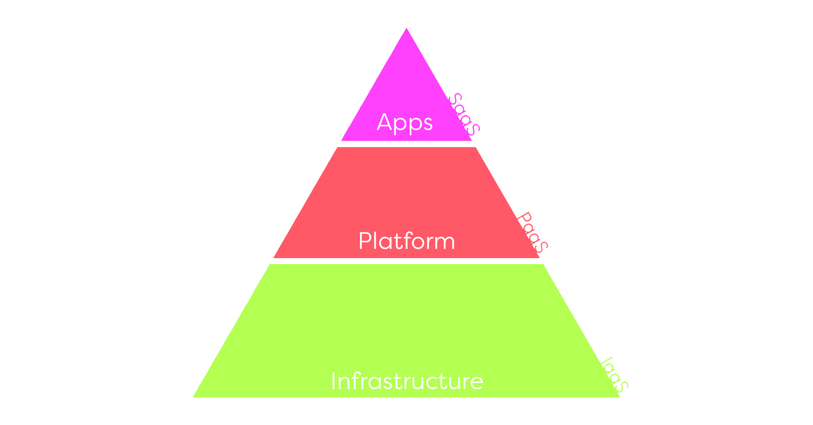

# Cloud Computing

## Índice

- ##### [Qué es](#id1)

- ##### [Arquitectura de servicios](#id2)

- ##### [Servicios en la nube](#id3)

  - ###### En el lado del servidor

  - ###### En el lado del cliente

- ##### [Análisis de aplicaciones](#id4)

  - ###### Base de datos

  - ###### Suite de ofimática

  - ###### Servicio de streaming de música

  - ###### Redes neuronales

  - ###### Videojuegos

- ##### [UWU](#id5)

## Qué es

Cloud Computing es un paradigma que permite ofrecer servicios de computación a través de una red, que normalmente suele ser internet. Dicho paradigma surge por la necesidad de compartir los recursos de un sistema (ofrecer servicios) entre distintos usuarios concurrentemente.  Con el avance de la tecnología este paradigma se ha vuelto indispensable para el uso cotidiano de cualquier persona, ya que la inmensa mayoría de las empresas ofrece sus servicios en la nube. 

## Arquitectura de servicios

Dentro del *cloud computing* podemos distinguir la arquitectura según los servicios que se ofrecen. Y podemos diferenciar los siguientes bloques, aunque hay muchos más:

**Software as a service (SaaS) :** Los proveedores instalan y gestionan el software de sus aplicaciones en la nube, mediante la cual los clientes pueden acceder a él.

En este grupo podemos encontrar servicios como Gmail, Google Docs, Dropbox, Evernote...

**Platform as a service (PaaS) :** Se ofrece un entorno software con herramientas específicas que permite a los clientes que puedan interactuar con un determinado sistema sin preocuparse de actualizarlo o instalar las herramientas que van a usar.

Proveedores de este servicio son Google App Engine, Amazon Web Services, OpenShift...

**Infrastructure as a service (IaaS) :** En este bloque se busca ofrecer un recurso. Cuando los clientes interactúan con un servicio de infraestructuras están tratando con máquinas virtuales que tienen la capacidad y recursos que has contratado.

Contratar infraestructura te asegura tener un sistema fiable, actualizado y escalable. En caso de necesitar más recursos puedes contratar más, antes que expandir una granja web, lo que es mucho más costoso.

Proveedores de este servicio son Amazon Elastic Computer Cloud (EC2), Microsoft Azure, Google Compute Engine...

## Servicios en la nube

### En el lado del servidor

Como hemos visto en esta asignatura, el tener un servicio alojado en la web nos permite escalar el sistema para poder ofrecer el servicio a más usuarios al mismo tiempo, ofrecer una respuesta más rápida ante un proceso pesado de cálculo, mayor capacidad de almacenamiento... etc.

Para el desarrollo de estas aplicaciones en el ámbito del servidor el lenguaje más utilizado es PHP, con casi un 80% de uso. Al desarrollar aplicaciones en el servidor, el programa actúa como una caja negra para el cliente, ya que a partir de una entrada de datos obtiene una salida, sin saber lo que se ha hecho por dentro. El hecho de programar aplicaciones en el servidor nos permite ofrecer una respuesta más rápida y no revelar nuestro código.

### En el lado del cliente

A pesar de que ejecutar una aplicación en la nube suela ser más rápido que ejecutar una aplicación en el sistema del usuario, la comunicación entre cliente y servidor está acotada por la latencia de red, lo que puede llegar a hacer que el diálogo con el servidor y la respuesta que ofrece sea más lenta que lo que se tardaría al ejecutar la aplicación en el cliente.

Debido a esto surge Javascript, un lenguaje de programación que permite ejecutar código y manejar información en el lado del cliente, sin necesidad de establecer una comunicación con el servidor para cada operación. 

Esto no sólo resuelve el problema que tenemos con el tiempo de respuesta, si no que al tratar con un sólo lenguaje que interpreta el navegador podemos implementar aplicaciones capaces de ser ejecutadas desde casi cualquier dispositivo.

Con el nacimiento de Javascript, varios desarrolladores ven su potencial y comienzan a importar sus aplicaciones a la web usando usando sus propias  modificaciones del lenguaje. Para evitar la incompatibilidad, el W3C (World Wide Web Consortium), diseña el estándar DOM (Document Object Model) con el que las partes de un documento HTML son objetos a los que JS puede acceder.

Desde que surgió Javascript se han creado varios lenguajes de programación web, aunque a día de hoy se ha convertido en uno de los más populares y usados por distintos desarrolladores.

## Análisis de aplicaciones

Para tratar el tema escogeré varias aplicaciones que podemos encontrar tanto en servidores de *cloud computing* como de escritorio y compararemos lo que supondría ejecutarlos en ambos lados. 

### Base de datos

¿Qué debemos pensar a la hora de decidir si ejecutar una Base de Datos en la nube o en el cliente? Almacenamiento principalmente, y no sólo secundario.

Cuando utilizamos un sistema en el que hagamos uso de una base de datos hacemos una serie de operaciones que el sistema debe resolver en memoria principal antes de escribir en disco (vistas, crear tablas, índices...). 

Sabiendo esto, ¿en qué casos no utilizarías *cloud computing*? En teoría nunca, es decir, siempre sería mejor utilizar *cloud computing*, ya que este tipo de aplicaciones, dependiendo del usuario, necesitará una capacidad de almacenamiento superior a la que ofrece un sistema convencional. Aunque puede quien piense que para almacenar el stock de una frutería no sea necesario utilizar *cloud computing* y baste con instalar un sistema sencillo en el ordenador personal. 

¿Qué problemas puede tener esto? Menos recursos, necesidad de mantener la consistencia de la base de datos, prevención ante la posible pérdida de datos por algún problema mediante uso de copias de seguridad...etc.

Contratando un servicio en la nube no sólo aseguramos que la aplicación siempre sea rápida, si no que estamos previstos ante probables errores que puedan hacer que perdamos la información, que en algunos casos es incluso más "cara" que la infraestructura.

### Suite de ofimática

Cuando tratamos con una suite de ofimática lo principal que buscamos es poder escribir y hacer nuestros cálculos de forma rápida y eficiente. En el caso de un usuario promedio, que escribe algún documento de texto, hace alguna tabla con una hoja de cálculo, o crea una presentación, no es necesario reservar 50 núcleos y 100GB de RAM para el proceso.

Es por esto que proveedores como Google o incluso Microsoft están llevando sus aplicaciones a la nube, aunque estas se ejecutan en el cliente. Actualmente aplicaciones como Google Docs puede incluso ejecutarse offline en el navegador, por lo que es mucho más liviano que instalar una aplicación nativa y sigue ofreciendo las ventajas de la nube.

Servicio de streaming de música

En este caso, cuando hablamos de streaming de música o cualquier otro medio audiovisual sí que priorizamos el almacenamiento secundario, ya que lo que nos permiten las plataformas es acceder a un amplísimo catálogo que en condiciones normales no podríamos almacenar en el sistema del usuario.

Dados los avances de la tecnología ahora somos capaces de descargar una canción en muy pocos segundos, por lo que ocupar almacenamiento guardando este tipo de archivos suele ser absurdo. 

### Entrenar redes neuronales

Al entrenar una red neuronal requerimos de tiempo de sobra para ejecutar el proceso o de una cantidad brutal de proceso de cálculo, ya que lo que buscamos resolver problemas y podemos optar por invertir en potencia o esperar un poco más para obtener el resultado.

### Videojuegos

Vaya, vaya, vaya... Cuando hablamos de videojuegos podemos hablar tanto del Candy Crush como del ultimísimo juego de cualquier compañía enorme para el que necesites 16GB de memoria de vídeo y un procesador con 32 núcleos a 6GHz cada uno.

Aunque he de decir que estos últimos suelen ser aplicaciones nativas, por lo que no entraría en conflicto con lo que estamos tratando, aunque ¿Sería rentable ejecutar videojuegos en la nube? Pues sí.

Últimamente compañías como Nvidia está testeando este mismo concepto. Crear máquinas virtuales con recursos más que suficientes para ejecutar juegos exigentes y ofrecer una biblioteca de juegos enorme, con la finalidad de que un usuario con una máquina no muy potente sea capaz de jugar títulos que normalmente no podría ni ejecutar en su sistema. Cuando hablamos de ejecutar cosas en remoto tenemos que tratar con la latencia de red, y si queremos enviar una cantidad ingente de imágenes por segundo de una alta resolución puede que ni aún invirtiendo en una muy buena estructura de red obtengamos los mismos resultados que ejecutando el programa en local.

Pero además de mejorar la tecnología también se mejora el software, por lo que hoy en día podemos encontrar una gran variedad de juegos que se ejecutan directamente en el navegador y poseen una buena calidad visual.

Al tratar este tema no podemos escoger solo una opción. Podemos ejecutar juegos en remoto, sabiendo que el cuello de botella reside en la latencia de red, y podemos ejecutar juegos no tan potentes desde el navegador usando los recursos del cliente. 

### Introducción

Internet surge debido a la necesidad de compartir información de una forma distinta a la convencional. Gracias a esto se crea una red que permite conectar distintos puntos y realizar un intercambio de información, lo que combinado con el uso de servidores hace que cualquier usuario pueda recibir un servicio siempre que esté conectado a la red.

El uso de servidores se extendió con la finalidad de que cada usuario conectado a la red pudiera acceder a ese servicio. Dicha extensión hizo que infinidad de empresas ofrecieran todo tipo de servicios en la red, ya sea potencia de cálculo, capacidad de almacenamiento, información, aplicaciones web... etc.  

Dadas las capacidades de las granjas web, siempre será mejor que en caso de querer ejecutar una aplicación sea el servidor el encargado de hacerlo y ofrecer el resultado al cliente, aunque el tiempo de respuesta estará acotado por la latencia de red, lo que hace que en determinados casos sea más rápido ejecutar un programa en el cliente que en la web. Esto hace que aparezca Javascript, un lenguaje que permite que sea el cliente el que ejecute una aplicación en su ordenador, lo que hace que ahora el cuello de botella lo provoquen los recursos del sistema en vez de la latencia de red.

Con Javascript podemos ejecutar aplicaciones en el navegador, lo que en el caso de aplicaciones simples, como las de ofimática, podamos obtener un rendimiento similar al de una aplicación nativa. 

<https://flickstiq.com/2018/04/microsoft-azure-cloud-gaming-tutorial/>

<https://www.youtube.com/watch?v=bGNBnPSNa8c>