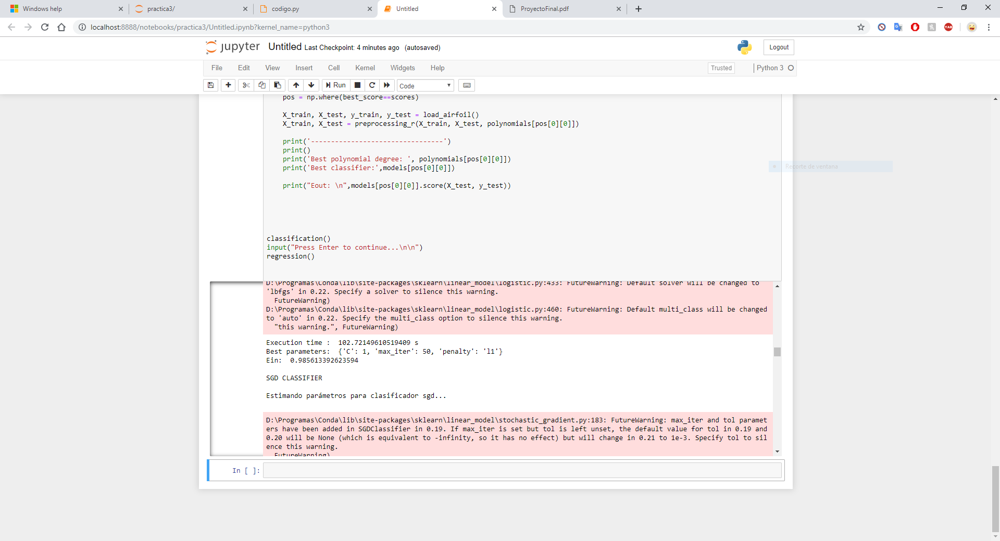
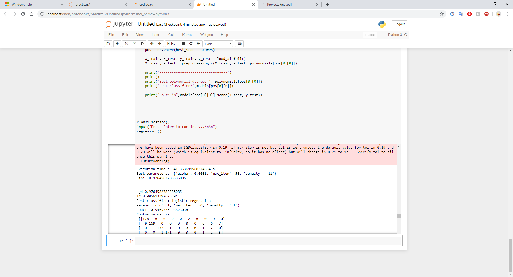
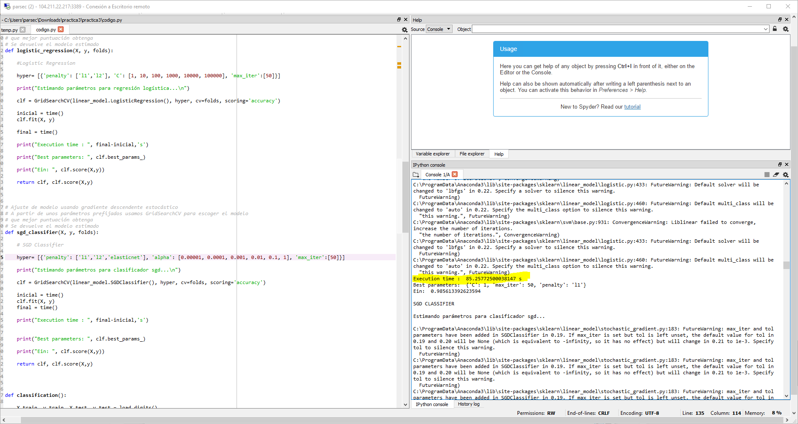
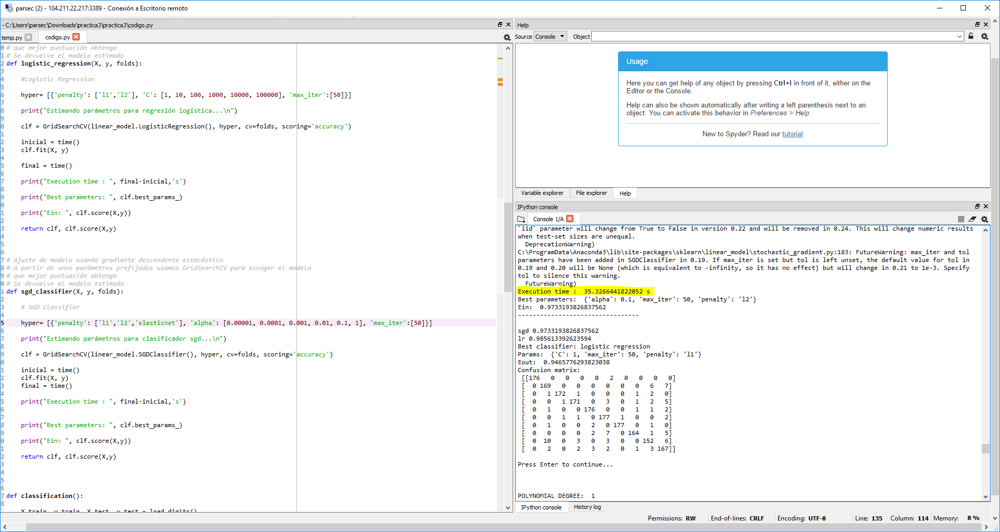

# Cloud Computing

## Índice

- ##### [Qué es](#id1)

- ##### [Arquitectura de servicios](#id2)

- ##### [Servicios en la nube](#id3)

  - ###### En el lado del servidor

  - ###### En el lado del cliente

- ##### [Análisis de aplicaciones](#id4)

  - ###### Base de datos

  - ###### Suite de ofimática

  - ###### Servicio de streaming multimedia

  - ###### Tareas de computación e inteligencia artificial

  - ###### Videojuegos

- ##### [Comparación de rendimiento](#id5)

  - ###### Videojuegos

  - ###### Aprendizaje automático

- ##### [Conclusión](#id6)

- ##### [Bibliografía](#id7)

## Qué es

Cloud Computing es un paradigma que permite ofrecer servicios de computación a través de una red, que normalmente suele ser internet. Dicho paradigma surge por la necesidad de compartir los recursos de un sistema (ofrecer servicios) entre distintos usuarios concurrentemente.  Con el avance de la tecnología este paradigma se ha vuelto indispensable para el uso cotidiano de cualquier persona, ya que la inmensa mayoría de las empresas ofrece sus servicios en la nube. 

## Arquitectura de servicios

Dentro del *cloud computing* podemos distinguir la arquitectura según los servicios que se ofrecen. Y podemos diferenciar los siguientes bloques, aunque hay muchos más:

**Software as a service (SaaS) :** Los proveedores instalan y gestionan el software de sus aplicaciones en la nube, mediante la cual los clientes pueden acceder a él.

En este grupo podemos encontrar servicios como Gmail, Google Docs, Dropbox, Evernote...

**Platform as a service (PaaS) :** Se ofrece un entorno software con herramientas específicas que permite a los clientes que puedan interactuar con un determinado sistema sin preocuparse de actualizarlo o instalar las herramientas que van a usar.

Proveedores de este servicio son Google App Engine, Amazon Web Services, OpenShift...

**Infrastructure as a service (IaaS) :** En este bloque se busca ofrecer un recurso. Cuando los clientes interactúan con un servicio de infraestructuras están tratando con máquinas virtuales que tienen la capacidad y recursos que has contratado.

Contratar infraestructura te asegura tener un sistema fiable, actualizado y escalable. En caso de necesitar más recursos puedes contratar más, antes que expandir una granja web, lo que es mucho más costoso.

Proveedores de este servicio son Amazon Elastic Computer Cloud (EC2), Microsoft Azure, Google Compute Engine...

## Servicios en la nube

### En el lado del servidor

Como hemos visto en esta asignatura, el tener un servicio alojado en la web nos permite escalar el sistema para poder ofrecer el servicio a más usuarios al mismo tiempo, ofrecer una respuesta más rápida ante un proceso pesado de cálculo, mayor capacidad de almacenamiento... etc.

Para el desarrollo de estas aplicaciones en el ámbito del servidor el lenguaje más utilizado es PHP, con casi un 80% de uso. Al desarrollar aplicaciones en el servidor, el programa actúa como una caja negra para el cliente, ya que a partir de una entrada de datos obtiene una salida, sin saber lo que se ha hecho por dentro. El hecho de programar aplicaciones en el servidor nos permite ofrecer una respuesta más rápida y no revelar nuestro código.

### En el lado del cliente

A pesar de que ejecutar una aplicación en la nube suela ser más rápido que ejecutar una aplicación en el sistema del usuario, la comunicación entre cliente y servidor está acotada por la latencia de red, lo que puede llegar a hacer que el diálogo con el servidor y la respuesta que ofrece sea más lenta que lo que se tardaría al ejecutar la aplicación en el cliente.

Debido a esto surge Javascript, un lenguaje de programación que permite ejecutar código y manejar información en el lado del cliente, sin necesidad de establecer una comunicación con el servidor para cada operación. 

Esto no sólo resuelve el problema que tenemos con el tiempo de respuesta, si no que al tratar con un sólo lenguaje que interpreta el navegador podemos implementar aplicaciones capaces de ser ejecutadas desde casi cualquier dispositivo.

Con el nacimiento de Javascript, varios desarrolladores ven su potencial y comienzan a importar sus aplicaciones a la web usando usando sus propias  modificaciones del lenguaje. Para evitar la incompatibilidad, el W3C (World Wide Web Consortium), diseña el estándar DOM (Document Object Model) con el que las partes de un documento HTML son objetos a los que JS puede acceder.

Desde que surgió Javascript se han creado varios lenguajes de programación web, aunque a día de hoy se ha convertido en uno de los más populares y usados por distintos desarrolladores.

## Análisis de aplicaciones

Para tratar el tema escogeré varias aplicaciones que podemos encontrar tanto en servidores de *cloud computing* como de escritorio y compararemos lo que supondría ejecutarlos en ambos lados. 

### Base de datos

¿Qué debemos pensar a la hora de decidir si ejecutar una Base de Datos en la nube o en el cliente? Almacenamiento principalmente, y no sólo secundario.

Cuando utilizamos un sistema en el que hagamos uso de una base de datos hacemos una serie de operaciones que el sistema debe resolver en memoria principal antes de escribir en disco (vistas, crear tablas, índices...). 

Sabiendo esto, ¿en qué casos no utilizarías *cloud computing*? En teoría nunca, es decir, siempre sería mejor utilizar *cloud computing*, ya que este tipo de aplicaciones, dependiendo del usuario, necesitará una capacidad de almacenamiento superior a la que ofrece un sistema convencional. Aunque puede quien piense que para almacenar el stock de una frutería no sea necesario utilizar *cloud computing* y baste con instalar un sistema sencillo en el ordenador personal. 

¿Qué problemas puede tener esto? Menos recursos, necesidad de mantener la consistencia de la base de datos, prevención ante la posible pérdida de datos por algún problema mediante uso de copias de seguridad...etc.

Contratando un servicio en la nube no sólo aseguramos que la aplicación siempre sea rápida, si no que estamos previstos ante probables errores que puedan hacer que perdamos la información, que en algunos casos es incluso más "cara" que la infraestructura.

### Suite de ofimática

Cuando tratamos con una suite de ofimática lo principal que buscamos es poder escribir y hacer nuestros cálculos de forma rápida y eficiente. En el caso de un usuario promedio, que escribe algún documento de texto, hace alguna tabla con una hoja de cálculo, o crea una presentación, no es necesario reservar 50 núcleos y 100GB de RAM para el proceso.

Es por esto que proveedores como Google o incluso Microsoft están llevando sus aplicaciones a la nube, aunque estas se ejecutan en el cliente. Actualmente aplicaciones como Google Docs puede incluso ejecutarse offline en el navegador, por lo que es mucho más liviano que instalar una aplicación nativa y sigue ofreciendo las ventajas de la nube.

### Servicio de streaming multimedia

En este caso, cuando hablamos de streaming de música, vídeo, imágenes... sí que priorizamos el almacenamiento secundario, ya que lo que nos permiten las plataformas es acceder a un amplísimo catálogo que en condiciones normales no podríamos almacenar en el sistema del usuario.

Dados los avances de la tecnología ahora somos capaces de descargar cualquier medio en muy pocos segundos, por lo que ocupar almacenamiento guardando este tipo de archivos suele ser absurdo y el tiempo media de respuesta mientras se manda la petición y comenzamos a disfrutar del contenido multimedia es prácticamente despreciable.

Los servicios de streaming te permiten acceder a un catálogo más grande del que podrías almacenar desde cualquier dispositivo con conexión a la red al contrario que con los servicios locales mediante los que tendrías que ir traspasando los archivos entre todos tus dispositivos para poder replicar lo mismo que te ofrece un servicio de streaming. En este tema, el uso de los servicios en la nube otorgan una mejor experiencia de usuario.

### Tareas de computación e inteligencia artificial

Buscando resolver problemas de *big data* o *machine learning* lo primero que pensamos es que necesitamos una gran cantidad de potencia de cálculo para poder resolver esos problemas en un tiempo razonable, por lo que sin dudar optaremos por el *cloud computing*. 

Pero... ¿Supone tal mejora ejecutar nuestros programas en un servidor remoto sabiendo que los últimos procesadores comienzan a añadir unidades que permiten un cálculo específico de estos problemas? Pues depende, al igual que con la base de datos de una frutería, hay problemas de inteligencia artificial que no requieren de una gran capacidad, si no que con una máquina ordinaria podemos obtener buenos resultados en un tiempo razonable.

Aquí entra en juego otra vez el avance de la tecnología y cómo en los últimos dispositivos se están incluyendo más unidades especializadas a la resolución de un problema concreto, al igual que pasó varios años atrás con la inclusión de procesadores especializados en un tipo de cálculo concreto, como el cálculo de números en coma flotante y las FPUs (Floating-Point Unit). 

Un ámbito en el que podemos ver cómo se ha desarrollado este concepto es el mundo de los videojuegos, en el que gracias a la inteligencia artificial y la mejora en prestaciones de los sistemas para resolver estos problemas hemos pasado de NPCs que se comían las paredes a otros que sigilosamente te apuñalan por la espalda sin que te enteres. Aunque no es lo mismo conseguir que un personaje reaccione de una forma más inteligente que conseguir entrenar una red neuronal con un conjunto inmenso de datos. 

Cuando tratamos temas de computación pesada siempre será mejor ejecutar los programas en la nube, ya que para la ejecución de programas que tardan horas podemos sacrificar medio minuto de latencia mientras establecemos respuesta con el servidor antes que esperar el doble y ejecutar esos mismos programas en local.

### Videojuegos

Vaya, vaya, vaya... Cuando hablamos de videojuegos podemos hablar tanto del Candy Crush como del ultimísimo juego de cualquier compañía enorme para el que necesites 16GB de memoria de vídeo y un procesador con 32 núcleos a 6GHz cada uno.

Aunque he de decir que estos últimos suelen ser aplicaciones nativas, por lo que no entraría en conflicto con lo que estamos tratando, aunque ¿Sería rentable ejecutar videojuegos en la nube? Pues sí.

Últimamente compañías como Nvidia está testeando este mismo concepto. Crear máquinas virtuales con recursos más que suficientes para ejecutar juegos exigentes y ofrecer una biblioteca de juegos enorme, con la finalidad de que un usuario con una máquina no muy potente sea capaz de jugar títulos que normalmente no podría ni ejecutar en su sistema. Cuando hablamos de ejecutar cosas en remoto tenemos que tratar con la latencia de red, y si queremos enviar una cantidad ingente de imágenes por segundo de una alta resolución puede que ni aún invirtiendo en una muy buena estructura de red obtengamos los mismos resultados que ejecutando el programa en local.

Pero además de mejorar la tecnología también se mejora el software, por lo que hoy en día podemos encontrar una gran variedad de juegos que se ejecutan directamente en el navegador y poseen una buena calidad visual.

Al tratar este tema no podemos escoger solo una opción. Podemos ejecutar juegos en remoto, sabiendo que el cuello de botella reside en la latencia de red, y podemos ejecutar juegos no tan potentes desde el navegador usando los recursos del cliente. 

## Comparación rendimiento

Para comparar el rendimiento entre las aplicaciones usaré los distintos equipos:

- Local: 
  - CPU - Intel Core i5 6300HQ 4 Cores
  - 16 GB RAM
  - NVIDIA GEFORCE GTX 950m 2 GB VRAM
  - HDD 1TB 5400 RPM SATA 3.0Gbps
- Cloud: 
  - CPU - Intel Xeon E5-2690 v4 2.60GHz 6 Cores
  - 56 GB RAM
  - NVIDIA Tesla M60 8 GB VRAM
  - HDD 380 GB 500 MiB/s

Para comenzar he usado como ejemplo Minecraft, una aplicación programada en Java que no está muy bien optimizada.

### Videojuegos

#### Local

Al ejecutarla en local y generar el mapa tarda 64 segundos en completar la creación y comenzar a cargarlo. Una vez comenzamos a movernos por el mapa podemos ver que el juego da algunos tirones, y más aún cuando cambiamos la distancia de renderizado y la ponemos al máximo. Aunque también influye que estemos usando los propios recursos del sistema para grabar la pantalla.

#### Cloud

Al ejecutarla en local y generar el mapa tarda 61 segundos en completar la creación y comenzar a cargarlo. Al cargar el mapa y comenzar a movernos por él podemos ver que la ejecución es rápida, aunque da una apariencia de lentitud debido a la latencia de red. Al cambiar los ajustes de vídeo y colocarlos al máximo vemos que no varía la ejecución y sigue ejecutándose de forma fluida.

### Aprendizaje Automático

Dado que esta prueba no ha resultado muy distintiva probaré también a resolver un problema de aprendizaje automático usando Jupyter Notebook en mi máquina y Spyder en le máquina remota. Jupyter Notebook es una herramienta basada en web que usa los recursos del sistema, mientras que Spyder es una aplicación nativa del sistema.

#### Local

Para esta prueba he decidido por ejecutar la resolución de un problema mediante Regresión Logística y un Gradiente Descendente Estocástico, ambos algoritmos son iterativos y son testeados con varios parámetros para escoger el que mejor solución otorgue.

Al ejecutarlos en mi máquina he obtenido los siguientes resultados.

Usando regresión obtenemos un tiempo de ejecución de casi **103 segundos** para un máximo de 50 iteraciones, y en el caso del gradiente descendente obtenemos un tiempo de ejecución de **41 segundos** para el mismo número de iteraciones.

#### Cloud

Ahora vamos a proceder a ejecutar el mismo programa en el IDE de desarrollo Sypder, y podemos estimar que obtendremos un mejor resultado debido a que esta máquina cuenta con más potencia de cómputo.

Para los mismos algoritmos de antes obtenemos ahora un total de tiempo de ejecución de **85 segundos** para regresión logística y **35 segundos** para el caso de gradiente descendente.

## Conclusión

Hemos visto con distintos ejemplos que el *cloud computing* es un paradigma que ofrece muchas mejoras frente a la  computación en local, y cuando digo computación en local me refiero a lo típico de instalar tu sistema operativo y herramientas favoritas,  aunque no por ello en un futuro será lo único que se utilice. Lo que sí que se utilizará y será un estándar será la web, ya que gracias a unificar todo en un mismo sitio los desarrolladores podrán exportar sus productos a más usuarios sin necesidad de implementar varias versiones dependiendo de la arquitectura. 

En mi opinión creo que la programación web va a ir sustituyendo a la programación típica, y que combinada con el *cloud computing* con el paso del tiempo proporcionará una mejor experiencia de usuario que la actual, permitiendo mejor la eficiencia, eficacia e incluso reduciendo los costes.

## Bibliografía

<https://flickstiq.com/2018/04/microsoft-azure-cloud-gaming-tutorial/>

<https://www.youtube.com/watch?v=bGNBnPSNa8c>

<https://medium.com/@FedakV/what-is-the-cloud-pyramid-the-layers-of-devops-services-730ac137e8b8>

